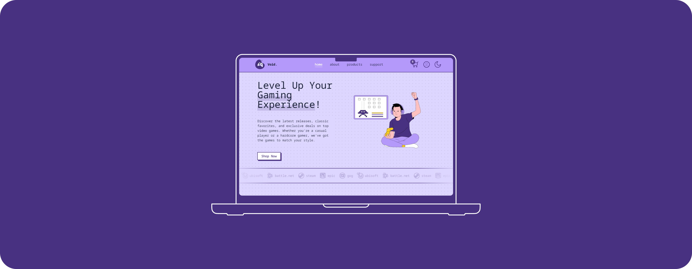

  

  <h3 align="center">Void Game Shop</h3>

  

    Void Game Shop, is a web application built with React and TailwindCSS. It serves as an online store for purchasing video games, featuring a user-friendly interface and various functionalities such as adding items to the cart, viewing product details, and managing user accounts. The project aims to provide a seamless shopping experience for gamers.
     
    <a href="https://project-x-f264.onrender.com/">view demo</a>
        
    <a href="">request feature</a>
     
    <a href="">report bug</a>
  

###  About The Project

Void Game Shop is a comprehensive web application designed to provide gamers with a seamless and enjoyable shopping experience.

> Built with **React** and **TailwindCSS**, this online store offers a user-friendly interface and a variety of functionalities to enhance the process of purchasing video games.

**Key Features:**

- User-Friendly Interface: The application boasts a clean and intuitive design, making it easy for users to navigate through different sections and find their desired products.
- Product Details: Users can view detailed information about each game, including descriptions, prices, and images.
- Shopping Cart: The application allows users to add items to their cart, view the cart's contents, and manage the quantities of each item.

<a href="#readme-top">back to top</a> 

###  Built With

 
 

<a href="#readme-top">back to top</a> 

###  Roadmap

- [x] Hero Section
- [x] Product Details Page
- [x] Shopping Cart Functionality
- [x] Responsive Design
- [x] Purchase Confirmation Page
- [x] 404 Page
- [x] Support Page
- [x] Light/Dark Theme Support
- [ ] About Page
- [ ] User Account Management
- [ ] "Support" Tickets System
- [ ] Dark Theme Palette for all components
- [ ] Multi-language Support
    - [ ] German

<a href="#readme-top">back to top</a> 

###  Contact

Lina Chvala - lina.chvala@gmail.com

Project Link: [Void Shop Demo](https://project-x-f264.onrender.com/)

<a href="#readme-top">back to top</a> 

###  License

Distributed under the MIT License. See `LICENSE.txt` for more information.

<a href="#readme-top">back to top</a> 
